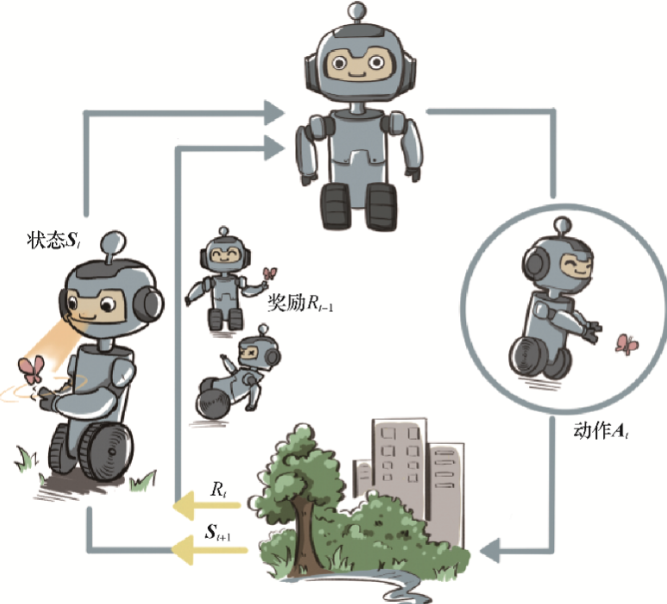

# 强化学习概述

## 简介

强化学习是机器人和其他控制系统的控制理论中不可或缺的一门学科。他通过一种与人类学习较为类似的方式去获取决策。这种方式在面对未知或者复杂系统的控制问题时尤为有效。

广泛地讲，强化学习是机器通过与环境交互来实现目标的一种计算方法。机器在环境的一个状态下做一个动作决策，把这个动作作用到环境当中，这个环境发生相应的改变并且将相应的奖励反馈和下一轮状态传回机器。通过迭代进行这种交互，机器可以最大化在多轮交互过程中获得的累积奖励的期望。

在这门学科中，我们用智能体（agent）这个概念来表示做决策的机器。相比于有监督学习中的“模型”，强化学习中的“智能体”强调机器不但可以感知周围的环境信息，还可以通过做决策来直接改变这个环境，而不只是给出一些预测信号。

智能体和环境之间具体的交互路径如下图所示。

在每一轮交互中，智能体感知到环境目前所处的状态 $S_i$，经过自身的计算给出本轮的动作 $A_i$，将其作用到环境中；环境得到智能体的动作后，产生相应的即时奖励信号 $R_i$ 并发生相应的状态转移，产生 $S_{i+1}$。智能体则在下一轮交互中感知到新的环境状态，依次类推。

这里，智能体有 3 种关键要素，即感知、决策和奖励。

感知指智能体在某种程度上感知环境的状态，从而知道自己所处的现状。比如，各种控制系统可以通过传感器得知自己所处的速度加速度、周围行人车辆等等。智能体根据感知到的当前状态计算出达到目标需要采取的动作的过程叫作决策。环境根据状态和智能体采取的决策动作，产生一个标量信号作为奖励反馈，这个标量信号衡量智能体这一轮动作的好坏。最大化累积奖励期望是智能体提升策略的目标，也是衡量智能体策略好坏的关键指标。

可以发现，强化学习的智能体是在和一个动态环境的交互中完成序贯决策的。动态的环境意味着其会随着某些因素的变化而不断演变，也就是随机过程。对于一个随机过程，其最关键的要素就是状态以及状态转移的条件概率分布。

如果在环境这样一个自身演变的随机过程中加入一个外来的干扰因素，即智能体的动作，那么环境的下一刻状态的概率分布将由当前状态和智能体的动作来共同决定，用最简单的数学公式表示则是

$$ 下一状态 \sim P(当前状态，智能体动作) $$

所以，环境未来状态的分布由当前状态和智能体决策的动作来共同决定。其每一轮状态转移都伴随着两方面的随机性：一是智能体决策的动作的随机性，二是环境基于当前状态和智能体动作来采样下一刻状态的随机性。

在上述动态环境下，智能体和环境每次进行交互时，环境会产生相应的奖励信号，其往往由实数标量来表示。这个奖励信号一般是诠释当前状态或动作的好坏的及时反馈信号。整个交互过程的每一轮获得的奖励信号可以进行累加，形成智能体的整体回报。根据环境的动态性我们可以知道，即使环境和智能体策略不变，智能体的初始状态也不变，智能体和环境交互产生的结果也很可能是不同的，对应获得的回报也会不同。因此，在强化学习中，我们关注回报的期望，并将其定义为价值，这就是强化学习中智能体学习的优化目标。

深入的说，强化学习目标是最大化智能体策略在和动态环境交互过程中的价值。策略的价值可以等价转换成奖励函数在策略的占用度量上的期望，即：

$$ 最优策略 = argmaxE_{(状态，动作)\sim策略的占用度量}[奖励函数(状态，动作)] $$

## 文章的阅读顺序

强化学习作为一系列的算法理论，具有逻辑的连贯性。因此，笔者建议按照以下的顺序阅读：

[马尔科夫过程](./马尔科夫过程.md)

[动态规划与时序差分](./动态规划与时序差分.md)

[DQN 及其进阶算法](./DQN%20及其进阶算法.md)

[Actor-Critic 算法](./Actor-Critic%20算法.md)

[TRPO 与 PPO 算法](./TRPO%20与%20PPO%20算法.md)

[DDPG 算法与 SAC 算法](./DDPG%20算法与%20SAC%20算法.md)

（前沿篇）