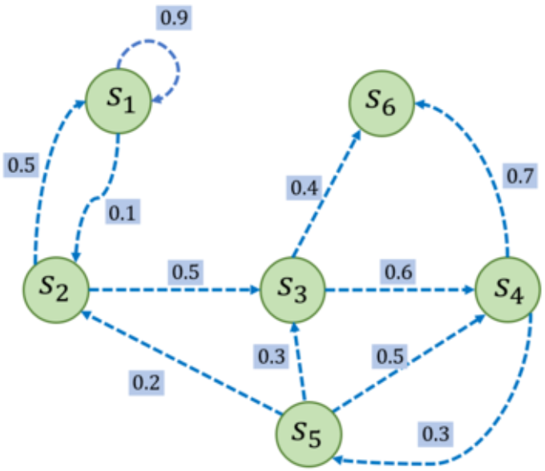
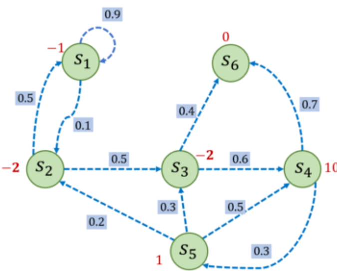

# 马尔科夫过程

## 提出一个问题

### 问题描述

在详细讲解强化学习和马尔科夫过程之前，我们需要了解一个场景：多臂老虎机问题。他可以被看作简化版的强化学习问题。与强化学习不同，多臂老虎机不存在状态信息，只有动作和奖励，算是最简单的“和环境交互中的学习”的一种形式。

在多臂老虎机（MAB）问题中，我们有一个拥有 K 根拉杆的老虎机，拉动每一根拉杆都对应一个关于奖励的概率分布 R。我们每次拉动其中一根拉杆，就可以从该拉杆对应的奖励概率分布中获得一个奖励 r。我们在各根拉杆的奖励概率分布未知的情况下，从头开始尝试，目标是在操作 T 次拉杆后获得尽可能高的累积奖励。由于奖励的概率分布是未知的，因此我们需要在“探索拉杆的获奖概率”和“根据经验选择获奖最多的拉杆”中进行权衡。

为了更容易的表述数学过程，我们用表达式抽象这个问题：

定义动作集合 $A=\{a_1,a_2,...,a_K\}$，集合中每个元素表示拉动一个拉杆，$a_t\in A$ 表示任意一个动作（随便拉动一个拉杆）。

定义 $R$ 为奖励概率分布，拉动每一根拉杆的动作 $a$ 都对应一个奖励概率分布 $R(r|a)$。奖励分布对于不同拉杆往往是不同的。

那么，如果假设每次只能拉动一个拉杆，那么多臂老虎机的目标就是最大化在时间步 $T$ 内累计奖励 $max\sum^{T}_{t=1}{r_t,r_t\sim R(\cdot|a_t)}$。

对于每一个动作 $a$，我们定义其期望奖励为 $Q(a)=E_{r\sim R(\cdot|a)}[r]$，所以拉杆的期望奖励肯定存在最大值。这个最大值我们表示为 $Q^*$。我们还可以引入懊悔 $R(a)=Q^*-Q(a)$ 用于衡量当前拉杆与最优拉杆的期望奖励差，那么在 $T$ 步内的累积懊悔 $\sigma_R=\sum_{t=1}^T R(a_t)$。

那么 MAB 问题的目标位最小化这个 $\sigma_R$。

### 估计奖励方法

这样，一个非常简单的计算方法就是我们可以通过多次拉动单根拉杆，通过平均值获取获奖的期望（假设奖励服从伯努利分布）。以此类推，我们就可以获得所有拉杆的 $Q(a)$ 和 $R(a)$。

### 探索与利用

上面的方法只是获取了从环境可以得到的奖励，但是没有策略知道我们应当采取哪些动作。

一个很简单的策略就是一直采取第一个动作，但是这就放弃了探索的可能性。我们还可以通过在足够的时间步中尝试拉动更多的拉杆。这些杠杆不一定获得最大的奖励，但是可以帮助我们摸清楚所有拉杆的奖励情况。这就是探索。如果我们只拉动在有限次的交互观测中已知奖励期望最大的那根，那就是利用。

例如，对于一个 10 臂老虎机，我们只拉动过其中 3 根拉杆，接下来就一直拉动这 3 根拉杆中期望奖励最大的那根拉杆，但很有可能期望奖励最大的拉杆在剩下的 7 根当中。即使我们对 10 根拉杆各自都尝试了 20 次，发现 5 号拉杆的经验期望奖励是最高的，但仍然存在着微小的概率—另一根 6 号拉杆的真实期望奖励是比 5 号拉杆更高的。

设计策略时就需要平衡探索和利用的次数，使得累积奖励最大化。一个比较常用的思路是在开始时做比较多的探索，在对每根拉杆都有比较准确的估计后，再进行利用。

### $\epsilon-greedy$ 算法

上文中我们提到，可以只拉动在有限次的交互观测中已知奖励期望最大的哪根，也就是纯粹的利用。这就是完全贪婪算法。但是这样全然忽略了探索的步骤。所以我们将其进行修改，就变成了 $\epsilon$-贪心算法。他在完全贪婪算法的基础上添加了噪声，每次以概率 $1-\epsilon$ 选择以往经验中期望奖励估值最大的那根拉杆利用，以概率 $\epsilon$ 随机选择一根拉杆探索。

随着探索次数的不断增加，我们对各个动作的奖励估计得越来越准，此时我们就没必要继续花大力气进行探索。所以在算法的具体实现中，我们可以令 $\epsilon$ 随时间衰减，即探索的概率将会不断降低（但绝对不会是 0）。

此外，还有很多上置信界算法、汤普森采样算法等，用来进行这种探索-利用的平衡。在此不再赘述。

## 马尔科夫性质

在现实世界中，很多问题的环境并不像多臂老虎机那样，在每个时间步的决策中都是独立的。也就是说，环境是会变化的（随机过程）。我们可以将环境的状态变化表示为集合 $S=\{S_1,S_2,...,S_t\}$。那么，已知历史信息 $(S_1,S_2,...,S_{t})$ 时下一时刻状态为 $S_{t+1}$ 的概率就可以表示为 $P(S_{t+1}|S_1,...,S_t)$。

如果某时刻的状态只取决于上一时刻的状态，那么这个随机过程就具有马尔科夫性质，也就是 $P(S_{t+1}|S_t)=P(S_{t+1}|S_1,...,S_t)$。我们认为，$t$ 时刻的状态包含了前面 $t-1$ 时刻的信息。所以，在多臂老虎机问题的基础上，我们仅仅需要添加一个变量 $S$，就可以引入状态信息，用来解决更为广泛的随机过程问题。

## 马尔科夫链

如果一个随机过程具有马尔科夫性质，那么他就是马尔科夫过程，也就是马尔可夫链。我们用元组 $\langle S,P\rangle$ 表示这样的过程，其中 S 为状态，P 为状态转移矩阵。也就是说，$P(i,j)=P(S_i,S_j)$ 表示从状态 $i$ 转化为状态 $j$ 的概率。下图给出了一组马尔科夫过程的例子。

其中每个绿色圆圈表示一个状态，每个状态都有一定概率转移到其他状态。其中 $s_6$ 为终止状态，因为他不可以转移到其他状态。状态之间的虚线箭头表示状态的转移，箭头旁的数字表示该状态转移发生的概率。从每个状态出发转移到其他状态的概率总和为 1。据此，可以写出他的状态转移矩阵：

$$ P = \begin{bmatrix}
    0.9 & 0.1 & 0 & 0 & 0 & 0 \\ 
    0.5 & 0 & 0.5 & 0 & 0 & 0 \\
    0 & 0 & 0 & 0.6 & 0 & 0.4 \\
    0 & 0 & 0 & 0 & 0.3 & 0.7 \\
    0 & 0.2 & 0.3 & 0.5 & 0 & 0 \\
    0 & 0 & 0 & 0 & 0 & 1 \\
\end{bmatrix} $$

如果给定一个马尔可夫过程，我们就可以从某个状态出发，根据它的状态转移矩阵生成一个状态序列，这个过程叫做采样。例如，从 $s_1$ 出发，可以生成序列 $s_1\rarr s_2\rarr s_3\rarr s_6$ 等。

### 马尔科夫奖励过程

单纯的马尔科夫过程并不包含对于状态转移链路（状态序列）的评价。这意味着我们无法通过单纯的矩阵进行优化。所以，我们在马尔科夫过程的基础上加入奖励函数 $r$ 和折扣因子 $\gamma$，就得到了马尔科夫奖励过程 $\langle S,P,r,\gamma\rangle$。其中，$r$ 为奖励函数，$r(s)$ 表示转移到状态 $s$ 时可以获得的奖励的期望（指定起点的前提下）。$\gamma\in(0,1)$ 为折扣因子，因为远期利益具有一定不确定性，有时我们更希望能够尽快获得一些奖励，所以我们需要对远期利益打一些折扣。值越大越关注长期的累计奖励。如果为 0 则表示完全不考虑未来的奖励。

在一个马尔科夫奖励过程（MRP）中，从第 $t$ 时刻状态 $S_t$ 开始到终止状态所有奖励的衰减之和被称为回报 $G_t$：

$$G_t=R_t+\gamma R_{t+1}+\gamma^2 R_{t+2}+...=\sum_{k=0}^\infty \gamma^k R_{t+k}$$

其中，$R_t$ 表示在时刻 $t$ 获得的奖励。比如下图中马尔科夫奖励过程的例子：

在图中，假设起点为 $s_1$，进入状态 $s_2$ 可以获得奖励 -2，表明我们不希望进入 $s_2$，进入状态 $s_4$ 可以获得奖励 10，表明我们希望进入 $s_4$。

比如选取 $s_1$ 为起始状态，设置 $\gamma$ 为 0.5，可以采样到状态序列 $s_1\rarr s_2\rarr s_3\rarr s_6$，可以计算出针对这条状态序列的回报 $G_1=-2.5$。

在 MRP 中，一个状态的期望回报（从这个状态出发的未来累计奖励的期望）被称为状态的价值。所有状态的价值组成了价值函数。这个函数的输入是某个状态，输出位价值，也就是：

$$V(s)=E[G_t|S_t=s]=E[R_t+\gamma V(S_{t+1}|S_t=s)]$$

在上式的后一个等号中，即时奖励的期望正是奖励函数的输出（$E[R_t|S_t=s]=r(s)$，而且等式中剩余的 $\gamma V(S_{t+1}|S_t=s)$ 可以通过状态转移得到。也就是：

$$V(s)=r(s)+\gamma\sum_{s'\in S} p(s'|s)V(s')$$

这就是贝尔曼方程，他对任何一个状态都成立。

贝尔曼方程还可以表示为矩阵的形式：

$$V=R+\gamma PV$$

$$\begin{bmatrix}
    V(s_1)\\V(S_2)\\...\\V(S_n)
\end{bmatrix}=\begin{bmatrix}
    r(s_1)\\r(s_2)\\...\\r(s_n)
\end{bmatrix}+\gamma\begin{bmatrix}
    P(s_1|s_1) & p(s_2|s_1) & ...& P(s_n|s_1) \\ 
    P(s_1|s_2) & p(s_2|s_2) & ...& P(s_n|s_2) \\
    ... \\
    P(s_1|s_n) & p(s_2|s_n) & ...& P(s_n|s_n)
\end{bmatrix} \begin{bmatrix}
    V(s_1)\\V(S_2)\\...\\V(S_n)
\end{bmatrix}$$

这是一种更加简洁的表示方式。根据这样的狮子，我们就可以求得 $V=(I-\gamma P)^{-1}R$。

### 马尔科夫决策过程